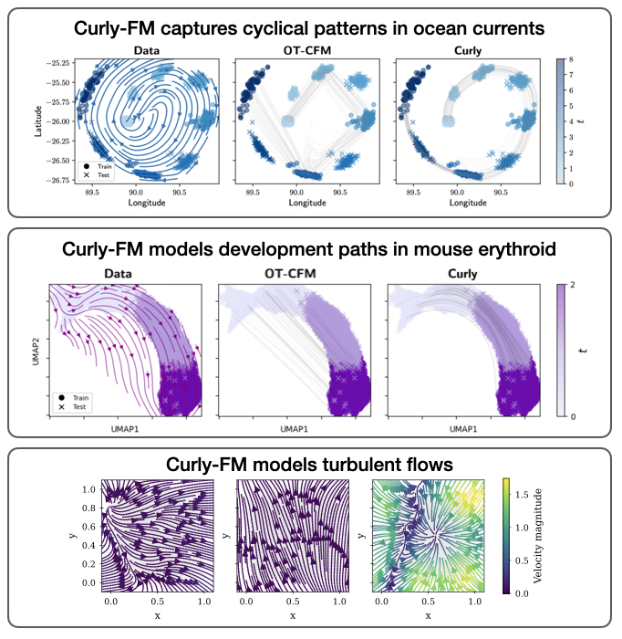

<div align="center">

# Curly Flow Matching

[](https://arxiv.org/abs/2510.26645)
[](https://github.com/pre-commit/pre-commit)
[](https://pytorch.org/get-started/locally/)
[](https://pytorchlightning.ai/)
[](https://hydra.cc/)
[](https://github.com/kpetrovicc/curly-flow-matching/blob/main/LICENSE)
<a href="https://github.com/ashleve/lightning-hydra-template"></a><br>

<div align="center">

<p float="left">
  
  
</p>


<div align="left">

## Description

<div align="left">

**Curly Flow Matching (Curly-FM)** is a new flow matching framework for learning non-gradient field dynamics by solving non-zero drift Schrödinger Bridge (SB) problem. In contrast, traditional flow-based generative models such as Conditional Flow Matching (CFM) commonly rely on least action objectives modeling gradient field dynamics. As a result, they struggle to represent inherently rotational, cyclical, or periodic behavior in data.

In natural sciences, most processes undergo non-gradient field dynamics. One such example is the cell cycle, where cells follow periodic trajectories in gene expression space, as revealed by RNA velocity. Curly-FM can recover such cyclical dynamics across cell cycle data, developmental trajectories, ocean currents, and turbulent flows, unlike widely-used trajectory inference baselines such as CFM and OT-CFM. We study both single marginal (acess to $p_0$ and $p_1$) and multi-marginal (access to $p_{t, t\in[0,1]}$) settings. 

Curly-FM is a simple two-stage framework. First, we learn neural bridges between marginal distributions by training a neural interpolant to match the drift of a chosen reference process. Second, we estimate the transport plan by computing a coupling that minimizes the discrepancy between the induced drifts, and then train the model using marginal flow matching objective.

This repo contains all elements needed to reproduce our results. See [this http link](https://arxiv.org/abs/2510.26645) for the paper.

The preprocessed data can be downloaded here:
* [Preprocessed cell cycle data](https://huggingface.co/datasets/kpetrovicc/curly-fm-cell-cycles/resolve/main/fibroblast_velocity.h5ad) which contains gene expressions and RNA velocities
* [Preprocessed oceans data](https://huggingface.co/datasets/kpetrovicc/curly-fm-oceans/resolve/main/oceans.npz) which contains particle positions and velocities
* [Preprocessed mouse erythroid data](https://huggingface.co/datasets/kpetrovicc/curly-fm-mouse-erythroid/resolve/main/cells.h5ad) which contains gene expressions and RNA velocities across multiple marginals

The raw data can be downloaded here: [Raw cell cycle data](https://zenodo.org/records/4719436) and [Raw mouse erythroid data](https://scvelo.readthedocs.io/en/stable/scvelo.datasets.gastrulation_erythroid.html). For usability, we provide the notebook [cell_data.ipynb](notebooks/cell_data.ipynb) which contain code for the data preprocessing, and code for data visualizations.

<div align="left">
  
If you find this code useful in your research, please cite our work.

<summary>
K. Petrović, L. Atanackovic, V. Moro, K. Kapuśniak, İ. Ceylan, M. Bronstein, J. Bose*, A. Tong*. "Curly Flow Matching for Learning Non-gradient Field Dynamics." <em>The Thirty-ninth Annual Conference on Neural Information Processing Systems (NeurIPS)</em>, 2025.
</summary>

```bibtex
@inproceedings{petrovic2025curly,
  title={Curly Flow Matching for Learning Non-gradient Field Dynamics},
  author={Katarina Petrovi{\'c} and Lazar Atanackovic and Viggo Moro and Kacper Kapu{\'s}niak and Ismail Ilkan Ceylan and Michael M. Bronstein and Joey Bose and Alexander Tong},
  booktitle={The Thirty-ninth Annual Conference on Neural Information Processing Systems},
  year={2025},
  url={https://openreview.net/forum?id=7cqKVDgFZQ}
}
```


## How to run

Install dependencies

```bash
# clone project
git clone https://github.com/kpetrovicc/curly-flow-matching.git
cd curly-flow-matching

# [OPTIONAL] create conda environment
conda create -n curlyfm python=3.9
conda activate curlyfm

# install pytorch according to instructions
# https://pytorch.org/get-started/

# install requirements
pip install -r requirements.txt
```

### Train cell cycles and CFD

Train model with chosen experiment configuration from [src.conf/experiment/](src/conf/experiment/)

```bash
python train.py experiment=experiment_name.yaml
```

You can override any parameter from command line like this

```bash
python train.py experiment=experiment_name.yaml trainer.max_epochs=1234 seed=42
```

### Train ocean currents

To train a model via CurlyFM on the ocean currents, use [ocean currents notebook](notebooks/oceans_currents.ipynb) in $\sigma\rightarrow 0$ setting and [SDE ocean currents notebook](notebooks/sde_oceans_currents.ipynb) in stochastic setting

### Train mouse erythroid
To train a model via CurlyFM on the ocean currents, use [2d mouse erythroid notebook](notebooks/2d_mouse_erythroid.ipynb) in 2d dimensions and [nd mouse erythroid notebook](notebooks/nd_mouse_erythroid.ipynb) for higher dimensions

### Visualizing cell cycle trajectories
To visualize cell cycle trajectories use [cell cycle visualization notebook](notebooks/cell_cycle.ipynb)

### Synthetic Assymetric Circles experiments
To reproduce trajectories in assymetric circles use [this notebook](notebooks/circles_toy.ipynb)


</div>

## Contributions
<div align="left">

Have a question? Found a bug? Missing a specific feature? Feel free to file a new issue, discussion or PR with respective title and description.

Before making an issue, please verify that:

- The problem still exists on the current `main` branch.
- Your python dependencies are updated to recent versions.

Suggestions for improvements are always welcome!
